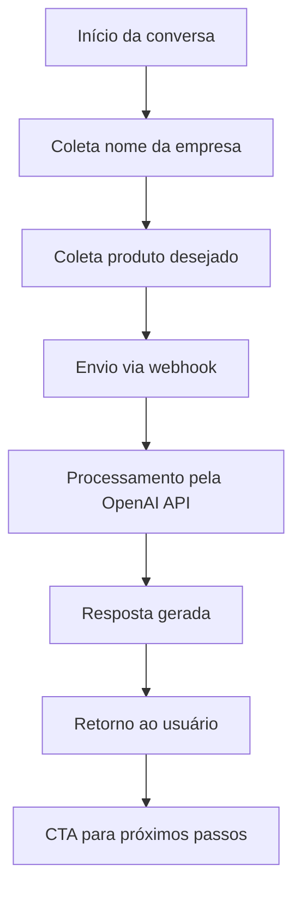

# 🤖 Assistente Comercial com IA — Projeto de Teste Synk

<div align="center">


**Uma solução inteligente para automatizar o atendimento comercial usando IA generativa**

[🚀 Testar Assistente](https://typebot.co/chatbot-comercial-synk-teste-ubyt635) • [📖 Documentação](#-fluxos-documentados) • [🎯 Demonstração](#demonstração)

</div>

---

## Visão Geral

Olá, equipe Synk! 🌟  
Este repositório apresenta o resultado do meu teste técnico para criar um assistente comercial inteligente usando Typebot + OpenAI API. O projeto reflete minha abordagem de **tecnologia sustentável** — priorizando eficiência, acessibilidade e experiência do usuário.

**Objetivos do projeto:**
- ✅ Capturar dados comerciais (empresa, produto, contato)  
- ✅ Gerar respostas personalizadas via IA generativa  
- ✅ Entrega de experiência conversacional fluida e profissional  
- ✅ Encaminhamento orientado para os próximos passos comerciais

---

## 🌱 Tecnologia Sustentável

### Design Eficiente
- Interface minimalista com tons terrosos e design clean  
- Otimização de recursos de IA para reduzir custos operacionais  
- Fluxos conversacionais naturais que reduzem fricção

### Integração Inteligente
- Chamadas de API otimizadas para menor latência  
- Fallbacks robustos para erros técnicos  
- Documentação clara para facilitar manutenção

---

## Demonstração

**Link principal:** [Chatbot Comercial Synk](https://typebot.co/chatbot-comercial-synk-teste-ubyt635)

📸 **Capturas do bot em funcionamento:**  
  


**Fluxo de conversação:**
1. Boas-vindas — apresentação acolhedora  
2. Coleta de dados — nome, empresa, produto  
3. Processamento IA — geração da resposta personalizada  
4. Entrega da proposta — mensagem contextualizada e profissional  
5. Call-to-Action — direcionamento para próximos passos

### Interface
- Tom conversacional com emojis  
- Paleta terrosa e minimalista  
- Responsivo: funciona bem em mobile e desktop  
- Feedback visual para cada fase do processo

---

## Arquitetura Técnica

**Stack principal:**
- **Frontend:** Typebot (No-code/Low-code)
- **IA:** OpenAI API (GPT-3.5/4)
- **Integração:** Webhook HTTP
- **Hospedagem:** Typebot Cloud

**Fluxo de dados:**


**Exemplo de prompt enviado para IA:**
```javascript
const prompt = `
Você é um assistente comercial da Synk, empresa focada em automação e IA.
Empresa cliente: ${empresa}
Produto interesse: ${produto}
Crie uma resposta comercial profissional, acolhedora e personalizada.
`;
```

---

## 📁 Estrutura do Repositório

```
assistente-comercial-synk/
├── README.md
├── index.html
├── docs/
│   ├── fluxo-typebot.md
│   └── fluxo-n8n.md
├── config/
│   ├── fluxo-typebot.json
│   └── n8n-workflow.json
└── assets/
    └── screenshots/
        ├── fluxo_typebot_construtor.png
        └── chatbot_interface_funcionando.png
```

---

## 📊 Fluxos Documentados

### 1. ✅ Typebot + OpenAI (Funcional)
**Documentado em:** `docs/fluxo-typebot.md`

- Blocos: Start, coleta de Nome, Empresa, Produto
- Webhook chama OpenAI com prompt estruturado
- Resposta da IA com CTA e fallback para erro
- Importação fácil via `config/fluxo-typebot.json`

### 2. 🛠️ Typebot + n8n + OpenAI (Experimento)
**Documentado em:** `docs/fluxo-n8n.md`

- Workflow importável via `config/n8n-workflow.json`
- Node Webhook recebe dados, envia para node OpenAI
- **Desafio:** payload não compatível com retorno formatado
- **Aprendizados:** uso de Function/Set para extrair texto, limpeza do payload, sugestões de retry

---

## 🧪 Processo de Desenvolvimento

**Desafio inicial:**
Experimentei Typebot + n8n + OpenAI, mas detectei limitações no retorno pelo webhook.

**Solução pragmática:**
- **Fluxo funcional:** Typebot + OpenAI – 100% operacional
- **Experimento documentado:** análise técnica aprofundada no n8n

**Principais aprendizados:**
- Debug e tratamento de erros via webhook
- Otimização de chamadas para OpenAI
- Design conversacional focado no cliente
- Implementação de fallback com mensagens amigáveis

---

## 📈 Métricas de Performance

- **Coleta de dados:** < 2s
- **Processamento IA:** 3–5s
- **Resposta final:** < 1s

---

## 👩🏽‍💻 Sobre a Desenvolvedora

**Lídi** — Artista em transição para tecnologia 🌱

- Background em Psicologia, Arte e atendimento clínico
- Estudante de Python, IA/ML e automações
- Projetos: Assistente Amazô, Encontro d'Água Hub
- Foco em tecnologia acessível, sustentável e centrada no humano

### Competências Técnicas
- **No-code/Low-code:** Typebot, n8n, Zapier
- **IA/ML:** OpenAI API, prompt engineering
- **Linguagens:** Python (iniciante), JavaScript (básico)
- **Soft skills:** UX thinking, design conversacional, documentação

---

## 🤝 Contato & Links

<div align="center">

[](https://github.com/seu-usuario)
[](https://linkedin.com/in/seu-perfil)
[](mailto:seu-email@example.com)

</div>

---

## 📄 Licença

Este projeto foi desenvolvido como teste técnico para a Synk.  
O código está disponível para avaliação e serve como referência educacional.

---

<div align="center">

**Feito com 💚 e tecnologia sustentável**

*Obrigada pela oportunidade de mostrar minha visão em tecnologia!*

</div>
